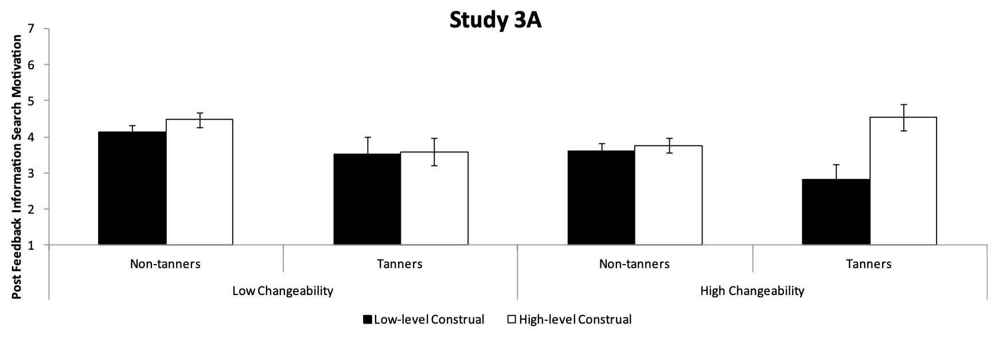

<!-- Replication reports should all use this template to standardize reporting across projects.  These reports will be public supplementary materials that accompany the summary report(s) of the aggregate results. -->

### Justification for choice of study

I selected this study for two reasons:

1. My research interest is in education and technology, and many edtech systems rely on the ability of technology to give immediate feedback to learners. Therefore, the subject of feedback from a psychological perspective is relevant to my research.

2. Study 3A was conducted online with crowdworkers and all the materials appear to be available either in appendices or in supplementary materials. The experiment also seems relatively straightforward to set up and deploy.

### Overview of procedure and anticipated challenges

Participants will be randomly assigned into two groups. Each group will be given a different construal manipulation task: the "high construal" group will be asked to list reasons *why* they should improve their health, while the "low construal" group will be asked to concrete ways *how* they can improve their health. 

Next, participants will be asked to read one of two versions of a message about skin cancer and skin health (also determined randomly). One version of the message ("high changeability") will explain that skin cancer risk is the result of changeable behaviors, while the other ("low changeability") will suggest that skin cancer risk is due to unchangeable traits.

Finally, participants will be given several questions that assess their reaction to the skin cancer message.

Because of the 2x2 setup of the conditions in this experiment, there is the risk that I may not be able to get a large enough sample size to see signficant results. If this is the case, then I will need to simplify the experiment to test just one manipulation.

### Links

Project repository (on Github): https://github.com/psych251/belding2015

Original paper (as hosted in your repo): https://github.com/psych251/belding2015/blob/main/original_paper/0146167215580776.pdf

Preregistration: https://osf.io/sb6ax

## Methods

### Power Analysis

The key analysis of interest that I will be reproducing is the following:

> [W]hen one’s risk was portrayed as changeable, high-level construal (M = 3.95, SD = 1.55) generally increased motivation to get supplementary information relative to low-level construal (M = 3.51, SD = 1.74), F(1, 160) = 7.81, p = .006, d = 0.44 (95% CI = [0.18, 0.70]).

A power analysis for an effect size of `f = 0.22` (i.e., `d = 0.44`) using a 2x2x2 fixed effects omnibus ANOVA gives a required sample size of 304 to achieve 80% power, 392 to achieve 90%, and 464 to achieve 95%.

The final sample size will be constrained by budget, since we only have $300 to pay participants with.

### Planned Sample

300 participants will be recruited on Prolific, an online platform for recruiting research participants. All participants were preselected to meet the following criteria:

- Country of Residence: United States
- Ethnicity: White/Caucasian

This sampling frame was chosen to match the demographics for the original study.

The sample size was selected to achieve roughly 80% power for the power analysis and to stay within budget. The study takes about 6 minutes for each participant, for which they were paid $1.00 (at a rate of \$10/hr).

### Materials

The materials for this replication study were taken directly from the supplementary materials provided by the original study: [Link](https://github.com/psych251/belding2015/blob/main/original_paper/10.1177_0146167215580776_online_appendix.pdf)

The original text and survey options for each task can be found on the following pages of the supplementary materials linked above:

- Construal manipulation task: 11-13
- Changeability manipulation task: 15-16
- Dependent variables: 17
- Demographic questions: 17

The original text and survey options for the construal manipulation task can be found on pg. 11-13.

### Procedure	

Participants first completed the why-how manipulation of construal level. Next, participants were given a skin cancer health message that either portrayed skin cancer risk as highly changeable or not very changeable. Afterward, participants responded to various questions that assess their motivation to seek additional information and their interpretation of the feedback as useful or not useful. Finally, participants answered a few demographic questions, including a question asking whether or not they tan.

The survey used for Pilot A can be found [here](https://stanforduniversity.qualtrics.com/jfe/form/SV_dpCb7GxEfUlyXBQ).

### Analysis Plan

Just like the original study, participants who do not follow instructions will be excluded from the data. The original study also excluded participants who were not White/Caucasian, but our preselection on Prolific screened for that already. The original authors did not report on the effects of possible covariates, so I plan to check whether age and gender have an effect on the dependent variables.

The answers to the survey questions measuring the dependent variables (motivation to get additional information and construal of the skin cancer warning message) were all written to fit a 1-7 Likert scale.

We will follow the analysis strategy outline in the original paper:

> We analyzed participants’ motivation to seek additional feedback-consis- tent information as a function of construal level (high-level vs. low-level construal), relevance (tanners vs. non-tanners), and changeability (high vs. low).

The paper reported a significant interaction between construal level, changeability, and relevance, which we will also explore. They report the following findings:

- Engaging in high-level construal generally increased motivation to get additional information relative to low-level construal. (did not replicate in Study 3B)
- Non-tanners tend to be more motivated to get additional information than tanners. (did not replicate in Study 3B)
- When one's risk is portrayed as unchangeable, non-tanners are generally more motivated than tanners to seek additional information. (did not replicate in Study 3B)
- When one's risk is portrayed as changeable, high-level construal generally increased motivation to seek additional information compared to low-level construal. (did not replicate in Study 3B)
- When one's risk is portrayed as changeable, tanners who engaged in high-level construal were generally more motivated to seek additional information relative to low-level. (**did** replicate in Study 3B)

We will also analyze the effects of our independent variables on the participants' interpretations of the author who wrote the skin cancer warning message:

> We analyzed participants’ attributions of the authors’ intentions as a function of construal level (high-level vs. low-level construal), relevance (tanners vs. non-tanners), and changeability (high vs. low).

The authors of the original paper report these findings:

- Those who were led to believe that skin cancer risk was changeable rather than unchangeable were more likely to interpret the author's intentions as helpful rather than threatening. (did not replicate in Study 3B)
- Those engaged in high-level construal perceived feedback about changeable risks to be more helpful than unchangeable risks. (did not replicate in Study 3B)

Finally, the authors explored whether interpretations of authors' intentions could be a potential mediator:

> To explore interpretations of authors’ intentions as a potential mediator, we tested the indirect effect of the interaction between construal level, relevance, and change- ability on feedback acceptance (as assessed by motivation for additional feedback-consistent information) through interpretation of the author’s intentions using bias-corrected boot-strapping procedures (n = 1,000) to generate 95% CIs (Preacher & Hayes, 2008; Shrout & Bolger, 2002). These analyses revealed a statistically significant indirect effect in [Study A]: β3A–Indirect = 0.04, CI = [0.001, 0.10]

I have no idea how this analysis works but I could learn about it and try it!

### Differences from Original Study

The original study was conducted on Amazon Mechanical Turk, whereas the replication was done on Prolific, which changes the sampling frame of the replication. In addition, our participants were paid \$1.00 rather than \$0.50. Our sample size is also smaller than the original, which affects our ability to find significant results.

### Methods Addendum (Post Data Collection)

You can comment this section out prior to final report with data collection.

#### Actual Sample

The actual sample size of the study was 292. We had the budget to recruit 290 participants on Prolific, and I received three additional submissions that were unaccounted for. Considering that the URL of the final version of the survey was only shared on Prolific and nowhere else, I decided to keep all submissions except one that was incomplete.

#### Differences from pre-data collection methods plan

I decided not to collect demographic data on gender, and I will not be performing all the analyses laid out in the original analysis plan.


## Results

### Data preparation

Data preparation following the analysis plan. 
	
```{r echo=T, results='hide', message=F}
library(rmarkdown)
library(tidyverse)
library(knitr)
library(qualtRics)
library(afex) # anova functions
library(emmeans) 

# Set Qualtrics credentials
#qualtrics_api_credentials(api_key = "XX", base_url = "XX", install = TRUE)

raw_data = fetch_survey(surveyID = "SV_9uFliJw5R0Zevae") # force_request = TRUE)
```

```{r}
# Filter out participants who...
filtered_data = raw_data |> 
  filter(Q2 != "I do not approve") |> # did not consent to the study
  filter(!is.na(Q35_1)) |> #  did not finish the Likert scale questions
  filter(!is.na(Q36_1))

# Remove unneeded columns
filtered_data = filtered_data |>
  select(
    ResponseId,
    Q7, # high-level construal condition
    Q20, # low-level construal condition
    Q32, # high-changeability condition 
    Q34, # low-changeability condition
    Q35_1, Q35_2, Q35_3, # DV 1: motivation to seek info
    Q36_1, Q36_2, Q36_3, Q36_4, Q36_5, Q36_6, Q36_7, Q36_8, Q36_9, Q36_10, Q36_11, Q36_12, # DV 2: perception of health message
    Q37, # age
    Q38, # skin cancer history
    Q39, # tanning
    `Duration (in seconds)`
  ) |>
  mutate( # reverse scored items
    Q36_1 = 8 - Q36_1, 
    Q36_2 = 8 - Q36_2,
    Q36_3 = 8 - Q36_3, 
    Q36_4 = 8 - Q36_4
  )

# Rename columns and transform data in preparation for analysis
tidy_d = filtered_data |>
  transmute(
    id = ResponseId,
    construal_level = as.factor(if_else(is.na(Q7), "Low-level Construal", "High-level Construal")),
    changeability = as.factor(if_else(is.na(as.character(Q32)), "Low Changeability", "High Changeability")),
    tans = as.factor(if_else(Q39 == "Yes", "Tanners", "Non-tanners")),
    motivation_to_seek = rowMeans(select(filtered_data, c(Q35_1, Q35_2, Q35_3))),
    message_perception = rowMeans(select(filtered_data, c(Q36_1, Q36_2, Q36_3, Q36_4, Q36_5, Q36_6, Q36_7, Q36_8, Q36_9, Q36_10, Q36_11, Q36_12,))),
    seconds_spent = `Duration (in seconds)`
  )
# reorder factors to order in plot
tidy_d$construal_level = factor(tidy_d$construal_level, levels = c("Low-level Construal", "High-level Construal"))
tidy_d$changeability = factor(tidy_d$changeability, levels = c("Low Changeability", "High Changeability"))

tidy_d

# Create a table of summary statistics
summary_d = tidy_d |>
  group_by(construal_level, changeability, tans) |>
  summarize(
    mean_motivation_to_seek = mean(motivation_to_seek),
    se_motivation_to_seek = sd(motivation_to_seek) / sqrt(n()),
    mean_message_perception = mean(message_perception),
    se_message_perception = sd(message_perception) / sqrt(n()),
  )

summary_d
```

### Confirmatory analysis

For the confirmatory analysis, I tried to reproduce this key analysis of interest:

> [W]hen one’s risk was portrayed as changeable, high-level construal (M = 3.95, SD = 1.55) generally increased motivation to get supplementary information relative to low-level construal (M = 3.51, SD = 1.74), F(1, 160) = 7.81, p = .006, d = 0.44 (95% CI = [0.18, 0.70]).

```{r}
anova_result = aov_car(motivation_to_seek ~ construal_level * changeability * tans
                + Error(id), data = tidy_d)
anova_result

effects_by_type = emmeans(anova_result, ~construal_level|changeability)
effects_by_type

tests_for_effects = pairs(effects_by_type, adjust="none")
tests_for_effects
```

I also plotted the mean motivation to seek more information after reading the skin cancer health message for each of the combinations in the 2x2x2.

```{r}
ggplot(summary_d,
  aes(x = tans, y = mean_motivation_to_seek, fill = construal_level)) +
  geom_bar(position="dodge", stat="summary") +
  scale_y_continuous("Post-feedback Information Search Motivation", c(1,2,3,4,5,6,7), NULL, c(1,7)) +
  xlab(NULL) +
  labs(fill = NULL) +
  geom_errorbar(
    aes(
      ymin = mean_motivation_to_seek - se_motivation_to_seek,
      ymax = mean_motivation_to_seek + se_motivation_to_seek,
    ),
    position = position_dodge(width = 0.9),
    width = 0.4
  ) +
  facet_grid(~changeability)
```

The above plot comes from the data from this replication, while the below plot is taken from the original paper. Unfortunately, I was not able to locate all the exact means and standard deviations used to create the original plot, so I was unable to replot the original to make our plots consistent in appearance. Error bars represent standard error of the mean.



### Exploratory analyses

#### The original authors reported the following result that did replicate in their Study 3B. Are we able to replicate it?

> When one’s risk is portrayed as changeable, tanners who engaged in high-level construal were generally more motivated to seek additional information relative to low-level.

```{r}
effects_by_type = emmeans(anova_result, ~construal_level|changeability:tans)
effects_by_type

tests_for_effects = pairs(effects_by_type, adjust="none")
tests_for_effects
```

#### Did any of our independent variables affect how participants perceived the skin cancer health message?

```{r}
message_perception_anova_result = aov_car(message_perception ~ construal_level * changeability * tans
                + Error(id), data = tidy_d)
message_perception_anova_result

t.test(message_perception ~ construal_level, tidy_d, paired = FALSE)
t.test(message_perception ~ changeability, tidy_d, paired = FALSE)
t.test(message_perception ~ tans, tidy_d, paired = FALSE)
```

#### How many tanners participated compared to non-tanners? 

The original study reported recruiting 64 tanners out of 309 participants.

```{r}
tanner_counts = tidy_d |>
  group_by(tans) |>
  summarize(n = n())
tanner_counts
```

#### How much time did participants spend on the survey?

```{r}
median(tidy_d$seconds_spent)
```

## Discussion

### Summary of Replication Attempt

I was unable to replicate my key result of interest--when one's risk of skin cancer was portrayed as changeable, there was no significant difference in motivation to get supplementary information between the two construal level conditions. Additionally, I found no significant interactions between construal level, changeability, and tanning status.

### Commentary

There are various reasons that could explain why I was not able to replicate the results from the original study. First, the study was a single-vignette study that tried to induce a change within participants, and these kinds of studies tend not to replicate easily. 

Second, participants spent a median of only 6.05 minutes on the survey. It is possible that participants needed to spend more time engaging meaningfully with the construal level manipulation activity in order to see an effect. Unfortunately, I don't have breakdowns of time spent for different parts of the survey, so I am unable to check for patterns there.

I had wondered if the lack of significant effects on the tanning dimension could be due to a lack of tanners recruited, but we actually recruited proportionally more tanners than the original study (77/292, 26.3\%; compared to 64/309, 20.7\%).

In my exploratory analyses, I was able to replicate the following result from the original paper:

> Those who were led to believe that skin cancer risk was changeable rather than unchangeable were more likely to interpret the author’s intentions as helpful rather than threatening.

A t-test comparing the Likert scale scores of how helpful the skin cancer risk message was between the high changeability (M = 6.13) and low changeability (M = 5.83) conditions found a very significant difference, t = -3.22, p = 0.001.
